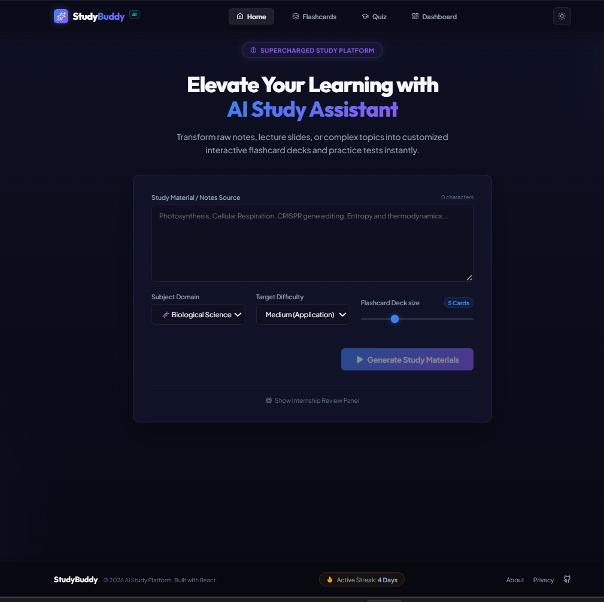
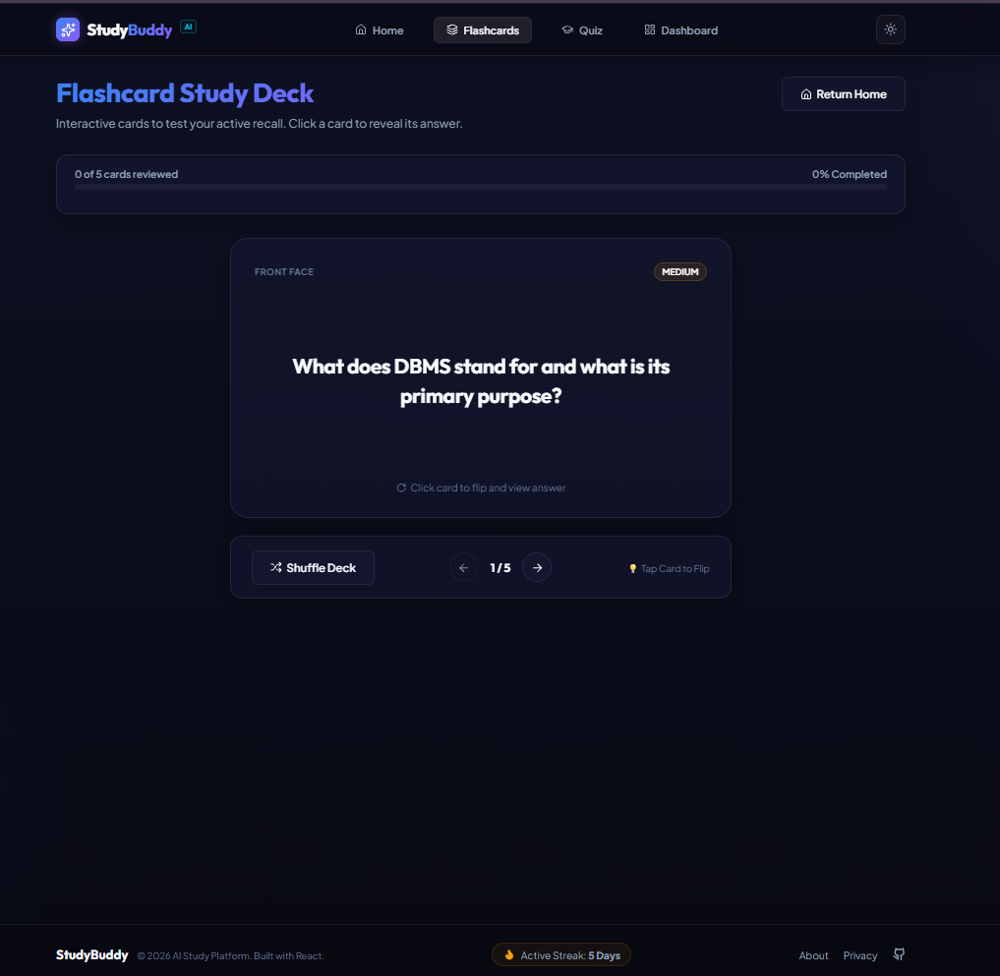
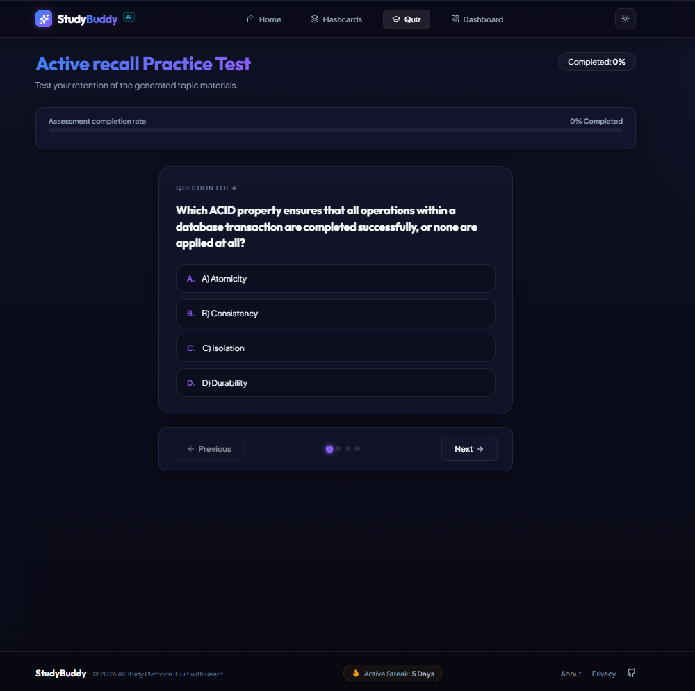
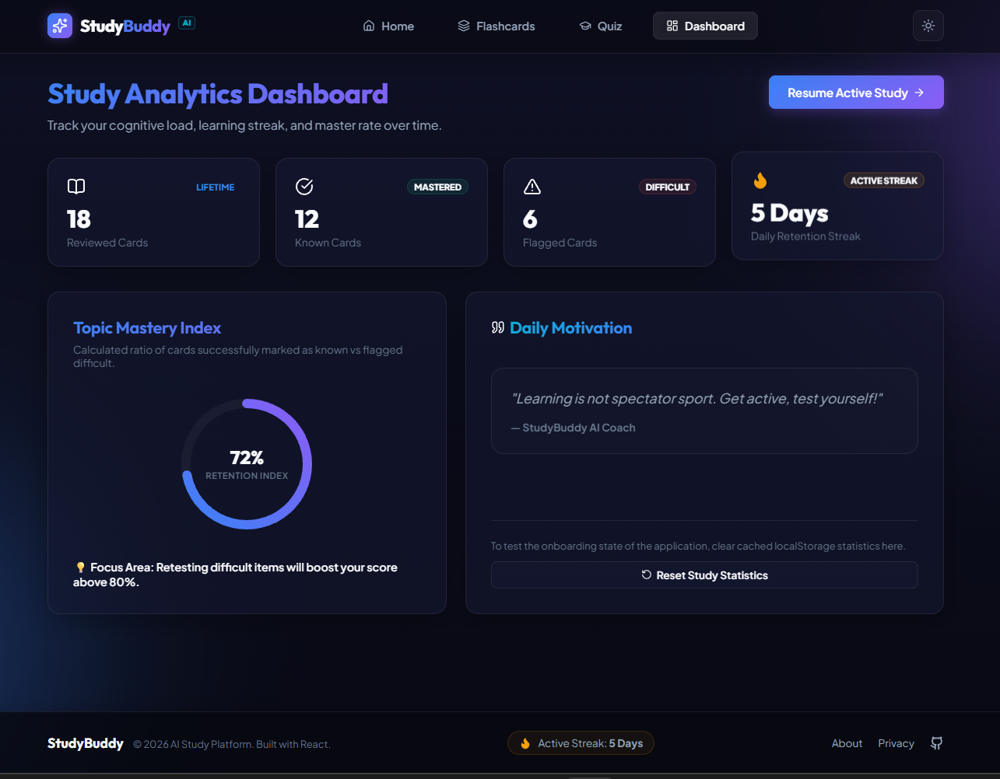

<div align="center">

# 📚 AI Study Buddy

### AI-Powered Flashcard & Quiz Generator using Google Gemini AI

Transform study notes into interactive flashcards and quizzes with the power of Generative AI.

<p align="center">

</p>

<p align="center">


</p>

</div>

---

# 🌟 Overview

AI Study Buddy is a full-stack AI-powered learning platform that transforms study notes into interactive flashcards and quizzes using **Google Gemini AI**.

Instead of manually preparing study material, users simply enter their notes, select a subject and difficulty level, and instantly receive AI-generated flashcards and quiz questions.

The application follows a secure client-server architecture where all AI requests are processed through an Express.js backend, ensuring API credentials remain protected.

---

# 🎯 Project Highlights

- ✅ Full-Stack Web Application
- ✅ Google Gemini AI Integration
- ✅ Secure Express.js Backend
- ✅ Interactive Flashcards
- ✅ AI Quiz Generation
- ✅ Responsive React UI
- ✅ REST API Architecture
- ✅ Live Deployment on Render

---

# 🚀 Live Demo

| Application | Link |
|-------------|------|
| 🌐 Frontend | https://ai-study-buddy-frontend-xhuk.onrender.com |
| ⚙️ Backend API | https://ai-study-buddy-b3ol.onrender.com |
| 💻 GitHub Repository | https://github.com/Vyshnavi161/AI-STUDY-BUDDY |

---

# ✨ Features

## 🤖 AI Features

- Generate Flashcards from Notes
- Generate Multiple Choice Quiz Questions
- Google Gemini AI Integration
- Subject Selection
- Difficulty Selection

## 📚 Learning Features

- Interactive Flashcards
- Quiz Evaluation
- Instant Feedback
- Learning Dashboard
- Progress Tracking

## ⚙️ Technical Features

- Secure REST API
- Environment Variables
- Loading Indicators
- Error Handling
- Responsive Design
- Component-Based Architecture

---

# 🏛 System Architecture

```text
                 +----------------------+
                 |    React Frontend    |
                 |     (Vite + React)   |
                 +----------+-----------+
                            |
                     HTTP Requests
                            |
                            ▼
                 +----------------------+
                 |   Express Backend    |
                 |      REST API        |
                 +----------+-----------+
                            |
                    Gemini API Request
                            |
                            ▼
                 +----------------------+
                 |   Google Gemini AI   |
                 +----------------------+
```

---

# 🔄 Application Workflow

1. User enters study notes.
2. React sends a POST request to the Express backend.
3. Express securely communicates with Google Gemini AI.
4. Gemini generates structured flashcards and quiz questions.
5. Backend returns the response as JSON.
6. React displays the generated content interactively.

---

# 🛠 Technology Stack

| Category | Technologies |
|----------|--------------|
| Frontend | React.js, Vite, JavaScript, CSS |
| Backend | Node.js, Express.js |
| AI | Google Gemini AI |
| Deployment | Render |
| Version Control | Git, GitHub |

---

# 📂 Project Structure

```text
AI-STUDY-BUDDY
│
├── public/
│
├── src/
│   ├── components/
│   ├── context/
│   ├── hooks/
│   ├── pages/
│   ├── services/
│   ├── styles/
│   └── utils/
│
├── server/
│   ├── controllers/
│   ├── routes/
│   ├── services/
│   ├── server.js
│   ├── package.json
│   └── .env.example
│
├── package.json
└── README.md
```

---

# ⚡ Installation

## Clone the Repository

```bash
https://github.com/vyshnaviMoka/AI-STUDY-BUDDY.git
```

## Install Frontend

```bash
npm install
```

## Install Backend

```bash
cd server
npm install
```

---

# 🔐 Environment Variables

Create a `.env` file inside the **server** directory.

```env
GEMINI_API_KEY=YOUR_GEMINI_API_KEY
PORT=5000
```

---

# ▶️ Running the Project

### Start Backend

```bash
cd server
npm start
```

### Start Frontend

```bash
npm run dev
```

Frontend

```
http://localhost:5173
```

Backend

```
http://localhost:5000
```

---

# 📡 API

## POST `/api/generate`

### Request

```json
{
  "notes": "Java is an object-oriented programming language...",
  "subject": "Programming",
  "difficulty": "Medium",
  "flashcardCount": 5
}
```

---

# 📷 Screenshots

## 🏠 Home

<p align="center">

</p>

---

## 📚 Flashcards

<p align="center">

</p>

---

## 📝 Quiz

<p align="center">

</p>

---

## 📊 Dashboard

<p align="center">

</p>

---

# 🔒 Security

- API key is securely stored using environment variables.
- Frontend never directly communicates with Google Gemini AI.
- Backend validates and processes all requests before forwarding them to the AI service.
- Sensitive files are excluded using `.gitignore`.

---

# 💡 Challenges & Solutions

### 🔒 Secure AI Integration

To prevent exposing the Gemini API key in the frontend, an Express.js backend was implemented to securely handle all AI requests.

### 🌐 Deployment

The frontend and backend were deployed separately on Render with proper environment variable configuration and API routing.

### ⚠ Error Handling

Implemented loading indicators, input validation, and graceful error messages to improve the overall user experience.

---

# 📖 Key Learnings

- Building secure REST APIs with Express.js
- Integrating Google Gemini AI into web applications
- Managing environment variables
- Deploying full-stack applications on Render
- Handling asynchronous API requests in React
- Designing reusable React components

---

# 🚀 Future Enhancements

- User Authentication
- Save Study History
- PDF Export
- AI Study Recommendations
- Voice-Based Learning
- Multi-language Support
- Dark Mode Persistence

---

# 👨‍💻 Developer

**Vyshnavi Moka**

- 💻 GitHub: https://github.com/vyshnaviMoka
- 📧 Email: vyshnavi_moka@srmap.edu.in

---

# 📜 License

This project was developed as part of an internship assignment and is intended for educational purposes.

---

<div align="center">

### ⭐ If you found this project useful, consider giving it a star!

Made with ❤️ using React, Express.js & Google Gemini AI

</div>
